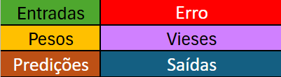

# 🚀 Rede Neural Artificial no Excel Web

O objetivo do trabalho em questão foi exemplificar o funcionamento do que acontece dentro de uma Epoch (ciclo de aprendizagem) em uma rede neural simples.  
A rede, obviamente, é bem limitada e não funcional no excel, pois não da pra treinar o suficiente do modo que está.  
A ideia aqui não foi ensinar o que é uma rede neural artificial, mas sim construir uma com o intuito de visualizar uma RNA em ação de forma explicíta; E uma pequena dose de autodesafio.

Deixei alguns rótulos com o significado de cada cor presente nas células:  

A rede usa SSE (Soma dos erros quadráticos) como função de custo com o ajuste de 1/2 para simplificar o cálculo do gradiente posteriormente.  
$$\frac{1}{2}\sum _{i=1}^n\left(y_i - \hat{y}_i\right)^2$$

Também utilizei a função ReLU nas saídas ocultas para zerar valores <= 0, e a função Sigmoide nas camadas de saída para predição binária.  

Configurei 3 neurônios ocultos e 1 de saída para consumir uma tabela 3x4 de treino, 3 linhas e 4 colunas, com valores gerados por IA apenas como um placeholder.

Utilizei o modo batch no gradiente descente, onde os pesos e vieses são atualizados apenas ao final da Epoch, para simplificar a disposição das células do Excel, deixando mais fácil o entendimento visual.

Como a rede opera sobre uma base de dados com 3 linhas, a Epoch precisa rodar a estrutura da rede 3 vezes. Cada execução rotulada com 'Linha n' no canto direito superior do painel.
Ou seja, esse trecho representa a rede atuando sobre aquela linha de 'Xs' e y alvo.

Use o projeto da forma que quiser, desde que não prejudique outros. Passar por essa experiência foi MUITO relevante para meu entendimento sobre RNA, e caso você esteja estudando sobre ou queira um recurso didático, espero que minha mera arte possa te ajudar de alguma forma.

---

A matemática para o cálculo dos gradientes:  
Gradiente médio da camada oculta:
Peso:
$$\frac{\partial J}{\partial w^{(1)}_{mj}} = \frac{1}{n}\sum^n_{i=1}(\hat{y_i}-y_i)\cdot\hat{y_i}(1-\hat{y_i})\cdot w^{(2)}_{jk}\cdot f'(z^{(1)}_i)\cdot x_{m,i}$$  
  
Viés:  
$$\frac{\partial J}{\partial  b^{(1)}_{j}} = \frac{1}{n}\sum^n_{i=1}(\hat{y_i}-y_i)\cdot\hat{y_i}(1-\hat{y_i})\cdot w^{(2)}_{jk}\cdot f'(z^{(1)}_i)$$

Gradiente médio da camada de saída:
Peso:
$$\frac{\partial J}{\partial w^{(2)}_{jk}} = \frac{1}{n}\sum^n_{i=1}(\hat{y_i}-y_i)\cdot\hat{y_i}(1-\hat{y_i})\cdot h_{i,j}$$

Viés:
$$\frac{\partial J}{\partial b^{(2)}} = \frac{1}{n}\sum^n_{i=1}(\hat{y_i}-y_i)\cdot\hat{y_i}(1-\hat{y_i}) $$

